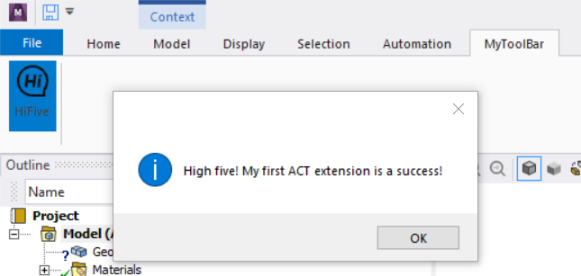

# ACT Extension for ANSYS Workbench
- - -
参考ANSYS官方帮助文件，step by step，复现官方案例，同时结合业务需求，定制化开发扩展功能。
- - -
## HiFive
My first ACT extension for Workbench Mechanical. 
No useful function, only realization of the connection between XML file, Python script and Mechanical.
### Output
通过点击ToolBar button，链接Python script，显示MessageBox。

